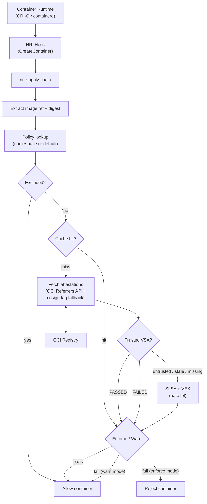

# Supply Chain NRI Plugin

[](https://github.com/saschagrunert/nri-supply-chain/actions/workflows/ci.yml)
[](https://github.com/saschagrunert/nri-supply-chain/actions/workflows/deploy.yml)
[](https://github.com/saschagrunert/nri-supply-chain/releases/latest)
[](https://codecov.io/gh/saschagrunert/nri-supply-chain)
[](https://pkg.go.dev/github.com/saschagrunert/nri-supply-chain)

An [NRI](https://github.com/containerd/nri) plugin for supply chain attestation
verification at the container runtime level. It intercepts container creation
events on [CRI-O](https://cri-o.io) or [containerd](https://containerd.io) and
verifies SLSA provenance, VEX, and VSA attestations before a container is
allowed to run.

Runtime-level enforcement cannot be bypassed by misconfigured admission
webhooks, disabled policy controllers, or direct kubelet API calls. The plugin
operates below the Kubernetes API layer, so every container that runs on a node
must pass verification.

<!-- toc -->

- [Quickstart](#quickstart)
- [Compatibility](#compatibility)
- [Architecture](#architecture)
- [Verification](#verification)
- [Configuration](#configuration)
- [Deployment and Examples](#deployment-and-examples)
- [Operations](#operations)
- [Verifying Releases](#verifying-releases)

<!-- /toc -->

## Quickstart

1. Download the latest release binary or container image from the
   [releases page](https://github.com/saschagrunert/nri-supply-chain/releases).

2. Create a configuration file (`config.toml`):

   ```toml
   verification = "enforce"
   policy_dir = "/etc/nri-supply-chain/policies"
   ```

3. Create a default policy (`/etc/nri-supply-chain/policies/default.json`):

   <!-- quickstart-policy-basic -->

   ```json
   {
     "trust": {
       "issuers": ["https://token.actions.githubusercontent.com"],
       "sanPatterns": ["https://github.com/saschagrunert/nri-supply-chain/**"],
       "sources": ["github.com/saschagrunert/*"]
     },
     "slsa": { "missingPolicy": "deny" },
     "vex": { "missingPolicy": "deny" }
   }
   ```

   <!-- /quickstart-policy-basic -->

4. Verify a single image to test the configuration:

   ```console
   nri-supply-chain --config config.toml \
     --verify-image ghcr.io/saschagrunert/nri-supply-chain:0.1.5
   ```

   The output is JSON with per-check details:

   ```json
   {
     "image": "ghcr.io/saschagrunert/nri-supply-chain:0.1.5",
     "digest": "sha256:...",
     "namespace": "default",
     "allowed": true,
     "checkResults": [
       { "type": "slsa", "status": "pass", ... },
       { "type": "vex", "status": "pass", ... }
     ]
   }
   ```

   To enable VSA-accelerated verification, add a `trust.verifiers` entry.
   A trusted VSA short-circuits SLSA and VEX checks:

   <!-- quickstart-policy-vsa -->

   ```json
   {
     "trust": {
       "issuers": ["https://token.actions.githubusercontent.com"],
       "sanPatterns": ["https://github.com/saschagrunert/nri-supply-chain/**"],
       "sources": ["github.com/saschagrunert/*"],
       "verifiers": [
         {
           "id": "https://github.com/saschagrunert/nri-supply-chain/.github/workflows/release.yml"
         }
       ]
     },
     "slsa": { "missingPolicy": "deny" },
     "vex": { "missingPolicy": "deny" }
   }
   ```

   <!-- /quickstart-policy-vsa -->

   With this policy the output becomes:

   ```json
   {
     "image": "ghcr.io/saschagrunert/nri-supply-chain:0.1.5",
     "digest": "sha256:...",
     "namespace": "default",
     "allowed": true,
     "checkResults": [
       { "type": "vsa", "status": "pass", ... }
     ]
   }
   ```

   In `enforce` mode images that fail verification are rejected. Use
   `verification = "warn"` to observe what would be blocked without
   rejecting. See [docs/verification.md](docs/verification.md) for the
   full verification flow.

5. Deploy the plugin (see [Deployment](docs/deployment.md) for all options):

   ```console
   kubectl apply -f deploy/kubernetes/
   ```

6. Check the logs and metrics to observe verification decisions.

## Compatibility

| Component  | Supported Versions  |
| ---------- | ------------------- |
| Kubernetes | 1.26+               |
| CRI-O      | 1.28+ (NRI enabled) |
| containerd | 1.7+ (NRI enabled)  |
| NRI        | 0.6+                |
| Go (build) | 1.26+               |

NRI must be enabled in the container runtime configuration. See
[Runtime Requirements](docs/deployment.md#runtime-requirements) for details.

## Architecture

<details>
<summary>Verification flow diagram</summary>



</details>

The plugin runs as a long-lived process that connects to the container runtime
via NRI. It exposes Prometheus metrics and supports live config reload via
SIGHUP.

At startup, the NRI Synchronize callback delivers the list of pods and
containers already running on the node. The plugin collects their image
references, resolving missing digests via registry `HEAD` requests when
needed (for example, on containerd where NRI annotations may omit the
digest). It deduplicates by digest and namespace, then spawns a background
goroutine that pre-verifies each image. This warms the cache so that
verification results are immediately available if those containers are
restarted, avoiding a cold-cache fetch penalty.

## Verification

The plugin verifies SLSA provenance, VEX, and VSA attestations. It extracts
image references and digests from CRI-O or containerd NRI annotations,
resolves missing digests via registry HEAD requests, and applies per-namespace
policies. VSA from a trusted verifier can short-circuit all other checks.

For the full verification flow, annotation handling details, and per-type
checks, see [docs/verification.md](docs/verification.md).

## Configuration

The plugin uses two configuration layers:

- **Operational config** (TOML): controls the plugin behavior (mode, timeouts,
  cache, metrics). See [docs/config.md](docs/config.md) for the full field
  reference and CLI flags.
- **Policy files** (JSON): define per-namespace trust roots and verification
  requirements. See [docs/policy.md](docs/policy.md) for the field reference,
  pattern matching semantics, and deployment patterns.

## Deployment and Examples

See [docs/deployment.md](docs/deployment.md) for all deployment options
(DaemonSet, systemd, DEB/RPM, container image, pre-installed NRI plugin) and
example configurations (gradual rollout, strict production, VSA-accelerated).

See [`deploy/examples/policies/`](deploy/examples/policies/) for ready-to-use
policy files covering keyless, key-based, VEX-strict, VSA-accelerated, and
other scenarios.

## Operations

The plugin exposes Prometheus metrics, `/healthz` and `/readyz` endpoints,
and supports live config reload via SIGHUP or filesystem watching. See
[docs/operations.md](docs/operations.md) for the metrics reference, alerting
rules, troubleshooting guide, internal limits, and security considerations.

## Verifying Releases

Release binaries are published with a SHA-256 checksum file that is signed
using [cosign](https://github.com/sigstore/cosign). An SBOM (Software Bill of
Materials) is generated with [syft](https://github.com/anchore/syft) for each
release. Build provenance attestations are generated via GitHub's
`actions/attest-build-provenance` action. Container images also include a
[VSA](https://slsa.dev/spec/v1.0/verification_summary) attestation that
records the verification result from the release pipeline.

To verify a release:

1. Verify the checksum file signature with cosign:

   ```console
   cosign verify-blob --bundle checksums.txt.sigstore.json checksums.txt
   ```

2. Verify the binary against the checksum file:

   ```console
   sha256sum --check checksums.txt
   ```

3. Verify the container image signature:

   ```console
   cosign verify ghcr.io/saschagrunert/nri-supply-chain:latest \
     --certificate-oidc-issuer https://token.actions.githubusercontent.com \
     --certificate-identity-regexp 'https://github.com/saschagrunert/nri-supply-chain/'
   ```

4. Verify build provenance attestation:

   ```console
   gh attestation verify nri-supply-chain_<version>_linux_amd64 \
     --repo saschagrunert/nri-supply-chain
   ```

5. Verify the VSA (Verification Summary Attestation) on the container image:

   ```console
   cosign verify-attestation ghcr.io/saschagrunert/nri-supply-chain:latest \
     --type https://slsa.dev/verification_summary/v1 \
     --certificate-oidc-issuer https://token.actions.githubusercontent.com \
     --certificate-identity-regexp 'https://github.com/saschagrunert/nri-supply-chain/'
   ```

6. Inspect the SBOM (generated with syft, integrity covered by the signed
   checksum file from step 1):

   ```console
   cat nri-supply-chain_<version>_linux_amd64.sbom.json | jq .
   ```
