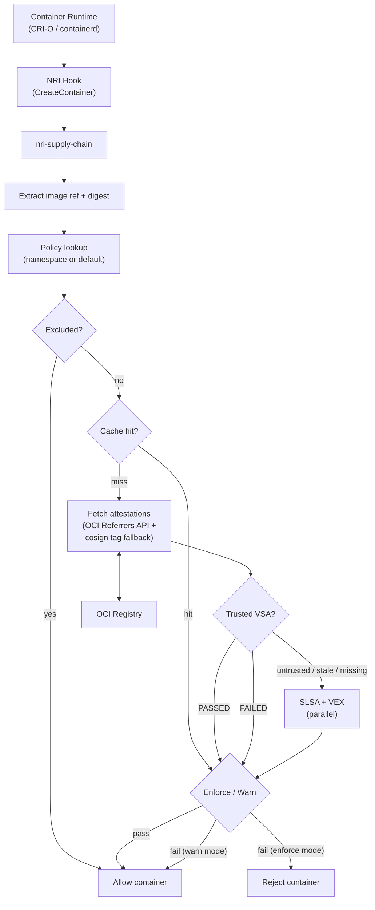

# Supply Chain NRI Plugin

[](https://github.com/saschagrunert/nri-supply-chain/actions/workflows/ci.yml)
[](https://codecov.io/gh/saschagrunert/nri-supply-chain)
[](https://pkg.go.dev/github.com/saschagrunert/nri-supply-chain)

An [NRI](https://github.com/containerd/nri) plugin for supply chain attestation
verification at the container runtime level. It intercepts container creation
events on [CRI-O](https://cri-o.io) or [containerd](https://containerd.io) and
verifies SLSA provenance, VEX, and VSA attestations before a container is
allowed to run.

Runtime-level enforcement cannot be bypassed by misconfigured admission
webhooks, disabled policy controllers, or direct kubelet API calls. The plugin
operates below the Kubernetes API layer, so every container that runs on a node
must pass verification.

<!-- toc -->

- [Architecture](#architecture)
- [Verification Flow](#verification-flow)
- [Verification Types](#verification-types)
  - [SLSA Provenance](#slsa-provenance)
  - [VEX (Vulnerability Exploitability eXchange)](#vex-vulnerability-exploitability-exchange)
  - [VSA (Verification Summary Attestation)](#vsa-verification-summary-attestation)
- [Configuration](#configuration)
  - [Operational Config](#operational-config)
  - [Policy Files](#policy-files)
- [Deployment](#deployment)
  - [Pre-installed NRI Plugin](#pre-installed-nri-plugin)
  - [External NRI Plugin](#external-nri-plugin)
  - [Kubernetes DaemonSet](#kubernetes-daemonset)
  - [Systemd Service](#systemd-service)
  - [DEB/RPM Packages](#debrpm-packages)
  - [Container Image](#container-image)
  - [NRI Runtime Configuration](#nri-runtime-configuration)
  - [Runtime Requirements](#runtime-requirements)
- [Examples](#examples)
  - [Gradual Rollout](#gradual-rollout)
  - [Strict Production](#strict-production)
  - [VSA-Accelerated Verification](#vsa-accelerated-verification)
- [CLI Flags](#cli-flags)
- [Metrics](#metrics)
  - [Health and Readiness Probes](#health-and-readiness-probes)
- [Operations](#operations)
  - [Config Reload](#config-reload)
  - [Logging](#logging)
  - [Troubleshooting](#troubleshooting)
  - [Monitoring and Alerting](#monitoring-and-alerting)
- [Internal Limits](#internal-limits)
- [Security Considerations](#security-considerations)
- [Verifying Releases](#verifying-releases)
- [Development](#development)
- [License](#license)

<!-- /toc -->

## Architecture

<details>
<summary>Verification flow diagram</summary>



</details>

The plugin runs as a long-lived process that connects to the container runtime
via NRI. It exposes Prometheus metrics and supports live config reload via
SIGHUP.

## Verification Flow

When a container is created, the plugin performs verification in this order:

1. **Image identification**: Extracts the image reference and digest from
   container annotations. CRI-O annotations are checked first. For the image
   reference, `io.kubernetes.cri-o.ImageName` is preferred; if absent,
   `io.kubernetes.cri-o.Image` is used as a fallback. For the digest,
   `io.kubernetes.cri-o.ImageRepoDigests` is preferred (the first
   comma-separated entry is parsed and the digest extracted from the portion
   after `@`); if absent, `io.kubernetes.cri-o.ImageRef` is used as a
   fallback. When CRI-O provides both a reference and a digest, that pair
   takes precedence. If CRI-O does not provide both, a complete containerd
   pair (`io.kubernetes.cri.image-name` + `io.kubernetes.cri.image-ref`) is
   used. If neither runtime provides a complete pair, available annotations
   from either source are combined.

2. **Policy resolution**: Looks up `<namespace>.json` in the policy directory.
   Falls back to `default.json` if no namespace-specific policy exists.

3. **Exclusion check**: If the image matches any `exclude` glob pattern in the
   policy, verification is skipped.

4. **Cache check**: If a cached result exists for this image digest and is
   within the configured TTL, returns it immediately.

5. **Attestation fetch**: Discovers attestations via the OCI Referrers API.
   Filters for DSSE-enveloped attestation bundles and extracts payloads. If
   the Referrers API returns no attestations, the plugin falls back to
   cosign's tag-based discovery scheme, looking for an image tagged
   `sha256-<digest>.att` in the same repository.

6. **VSA-first evaluation**:
   - If a trusted PASSED VSA is found, skip SLSA and VEX checks entirely.
   - If a trusted FAILED VSA is found, hard reject immediately (no fallback).
   - If no VSA is found, or the VSA is from an untrusted verifier or stale,
     fall through to direct verification.

7. **Parallel SLSA + VEX verification**: When VSA does not short-circuit,
   SLSA provenance and VEX checks run concurrently.

8. **Enforcement**: In `enforce` mode, failed verification rejects the
   container. In `warn` mode, failures are logged but allowed.

9. **Caching**: The result is cached for future lookups.

Latency model:

- With trusted VSA: `fetch + VSA verify`
- Without VSA: `fetch + max(SLSA verify, VEX verify)`

## Verification Types

### SLSA Provenance

Verifies [SLSA](https://slsa.dev) provenance v1 attestations.

Checks performed:

- **Subject digest**: The provenance `subject[].digest` must match the image
  digest.
- **Builder trust**: `runDetails.builder.id` must appear in the policy's
  `trust.builders` list.
- **Build type**: If `trust.buildTypes` is configured, the
  `buildDefinition.buildType` must match one of the allowed types.
- **Source repository**: If `trust.sources` is configured, the `source` in
  `externalParameters` must match an allowed glob pattern.
- **Unknown parameters**: If `provenance.rejectUnknownParameters` is enabled,
  unrecognized `externalParameters` fields cause rejection.

Note: `trust.builders[].maxLevel` is not checked during provenance
verification because provenance attestations do not declare a build level.
Use `vsa.minimumLevel` to enforce build level requirements.

When multiple provenance attestations exist, verification passes if any single
valid attestation from a trusted builder passes (any-pass semantics).

### VEX (Vulnerability Exploitability eXchange)

Verifies [OpenVEX](https://openvex.dev) v0.2.0 documents.

Status handling:

- `not_affected` or `fixed`: pass
- `affected`: fail
- `under_investigation`: controlled by `underInvestigationPolicy` (default:
  allow)

Product matching operates at the image level using digest comparison and PURL
(`pkg:oci/...`) matching.

When multiple VEX documents exist, the most restrictive result wins: any
`affected` status causes failure.

### VSA (Verification Summary Attestation)

Verifies [SLSA VSA](https://slsa.dev/spec/v1.0/verification_summary) v1
attestations.

Checks performed:

- **Verifier trust**: `verifier.id` must appear in `trust.verifiers`.
- **Verification result**: `PASSED` is required. `FAILED` from a trusted
  verifier is a hard reject that prevents fallback to SLSA/VEX.
- **Build level**: `verifiedLevels` must meet the `vsa.minimumLevel` threshold.
- **Resource URI**: `resourceUri` must match the image reference.
- **SLSA version**: `slsaVersion` must be >= `1.0`.
- **Policy match**: If `vsa.policy` is configured, `policy.uri` must match.
- **Freshness**: `timeVerified` must be within the `vsa.maxAge` window.

VSA-first logic:

- Trusted PASSED: short-circuits all other checks.
- Trusted FAILED: hard reject, no fallback allowed.
- Untrusted, stale, or missing: falls through to direct SLSA + VEX
  verification.

## Configuration

The plugin uses two configuration layers:

- **Operational config** (TOML): controls the plugin behavior (mode, timeouts,
  cache, metrics).
- **Policy files** (JSON): define per-namespace trust roots and verification
  requirements.

### Operational Config

The TOML parser uses strict mode: unknown keys cause a startup error. If the
config file contains fields that are not listed below (for example, leftover
keys from an older version or custom annotations), the plugin will refuse to
start. Remove or comment out any unrecognized keys before upgrading.

```toml
verification = "warn"
fetch_timeout = "30s"
fetch_failure_policy = "warn"
cache_ttl = "24h"
policy_dir = "/etc/nri-supply-chain/policies"
metrics_addr = "127.0.0.1:9090"
circuit_breaker_threshold = 5
circuit_breaker_cooldown = "30s"
# fetch_rate_limit = 50
```

| Field                       | Default                          | Description                                                        |
| --------------------------- | -------------------------------- | ------------------------------------------------------------------ |
| `verification`              | `disabled`                       | Mode: `disabled`, `warn` (log-only), `enforce` (reject on failure) |
| `fetch_timeout`             | `30s`                            | Per-fetch timeout for retrieving attestations from the registry    |
| `fetch_failure_policy`      | `warn`                           | Behavior when attestation fetch fails: `allow`, `warn`, `deny`     |
| `cache_ttl`                 | `24h`                            | TTL for cached verification results (`0s` disables caching)        |
| `policy_dir`                | `/etc/nri-supply-chain/policies` | Directory containing JSON policy files                             |
| `metrics_addr`              | `127.0.0.1:9090`                 | Prometheus metrics HTTP listen address                             |
| `circuit_breaker_threshold` | `5`                              | Consecutive fetch failures before a per-host circuit breaker opens |
| `circuit_breaker_cooldown`  | `30s`                            | Duration the circuit breaker stays open before allowing a probe    |
| `fetch_rate_limit`          | `0` (unlimited)                  | Maximum registry fetch requests per second                         |

### Policy Files

Policy files are JSON documents in `policy_dir`. The file `default.json`
applies to all namespaces. A file named `<namespace>.json` overrides the
default for that namespace. By default this is a full replacement; set
`"inherits": true` to inherit unset fields from the default policy (see
[docs/policy.md](docs/policy.md) for details).

```json
{
  "trust": {
    "builders": [{ "id": "https://github.com/actions/runner", "maxLevel": 3 }],
    "verifiers": [
      { "id": "https://example.com/verifier", "key": "/etc/keys/verifier.pub" }
    ],
    "issuers": ["https://accounts.google.com"],
    "sources": ["github.com/myorg/*"],
    "buildTypes": ["https://actions.github.io/buildtypes/workflow/v1"]
  },
  "exclude": ["test-*", "dev-*"],
  "provenance": {
    "missingPolicy": "deny",
    "rejectUnknownParameters": true
  },
  "vex": {
    "missingPolicy": "allow",
    "underInvestigationPolicy": "allow"
  },
  "vsa": {
    "minimumLevel": 2,
    "maxAge": "24h",
    "policy": "https://example.com/policy"
  },
  "signatures": {
    "requireTransparencyLog": true
  }
}
```

When no policy file matches a container's namespace (no `<namespace>.json` and
no `default.json`), the verifier denies the container with "no policy found for
namespace and no default policy configured." In `enforce` mode, an empty policy
directory blocks all containers. Always provide at least a `default.json` when
verification is enabled. An empty policy `{}` allows all containers without
performing any verification checks.

For the complete field reference, pattern matching semantics, and scenario-based
examples, see [docs/policy.md](docs/policy.md).

## Deployment

### Pre-installed NRI Plugin

Copy the binary to the NRI plugin directory. The filename encodes the plugin
index and name:

```console
cp build/nri-supply-chain /opt/nri/plugins/10-supply-chain
```

The runtime invokes the plugin automatically on container creation.

### External NRI Plugin

Run as a standalone process that connects to the NRI socket:

```console
./nri-supply-chain --config /etc/nri-supply-chain/config.toml
```

### Kubernetes DaemonSet

Deploy as a DaemonSet to run the plugin on every node in the cluster:

```console
kubectl apply -k deploy/kubernetes/
```

The manifests in `deploy/kubernetes/` include a Namespace, ConfigMap with
example config and policy, and the DaemonSet itself. Edit the ConfigMap to
match your environment before deploying.

### Systemd Service

A systemd unit file is provided at `deploy/systemd/nri-supply-chain.service`.
Install it and enable the service:

```console
cp deploy/systemd/nri-supply-chain.service /usr/lib/systemd/system/
systemctl daemon-reload
systemctl enable --now nri-supply-chain
```

Reload configuration without restarting:

```console
systemctl reload nri-supply-chain
```

### DEB/RPM Packages

Release builds include `.deb` and `.rpm` packages that install the binary,
systemd unit, and example configuration. Install with your package manager:

```console
# Debian/Ubuntu
sudo dpkg -i nri-supply-chain_*.deb

# RHEL/Fedora
sudo rpm -i nri-supply-chain-*.rpm
```

The packages enable the systemd service on install and stop it on removal.

### Container Image

Multi-arch container images (amd64, arm64) are published to
`ghcr.io/saschagrunert/nri-supply-chain` for each release. Images are signed
with cosign and built on distroless for a minimal attack surface.

```console
docker pull ghcr.io/saschagrunert/nri-supply-chain:latest
```

### NRI Runtime Configuration

When the plugin is deployed as a pre-installed NRI plugin (without the
`--config` flag), the container runtime can pass configuration inline via the
NRI `Configure` callback. The plugin parses this string as TOML using the same
format as the config file. This allows the runtime to manage plugin
configuration directly, for example through CRI-O's NRI plugin config or
containerd's NRI host configuration. If the `--config` flag is provided, the
inline NRI configuration is ignored.

### Runtime Requirements

- CRI-O with NRI enabled (`enable_nri = true` in CRI-O config) or containerd
  with NRI enabled.
- NRI socket at `/var/run/nri/nri.sock` (for external plugins).
- Registry access from the node to fetch OCI Referrers.

## Examples

See [`examples/policies/`](examples/policies/) for ready-to-use policy files
covering keyless, key-based, VEX-strict, VSA-accelerated, and other scenarios.

### Gradual Rollout

Start with `warn` mode and permissive policies to observe what would be
blocked, then switch to `enforce` once the supply chain is fully attested.

```toml
verification = "warn"
fetch_failure_policy = "allow"
policy_dir = "/etc/nri-supply-chain/policies"
```

```json
{
  "provenance": { "missingPolicy": "warn" },
  "vex": { "missingPolicy": "allow" }
}
```

### Strict Production

Enforce all verification with trusted builders only, deny on missing
attestations.

```toml
verification = "enforce"
fetch_failure_policy = "deny"
policy_dir = "/etc/nri-supply-chain/policies"
```

```json
{
  "trust": {
    "builders": [{ "id": "https://github.com/actions/runner", "maxLevel": 3 }],
    "verifiers": [
      { "id": "https://example.com/verifier", "key": "/etc/keys/verifier.pub" }
    ],
    "sources": ["github.com/myorg/*"]
  },
  "provenance": {
    "missingPolicy": "deny",
    "rejectUnknownParameters": true
  },
  "vex": {
    "missingPolicy": "deny"
  },
  "vsa": {
    "minimumLevel": 2,
    "maxAge": "24h"
  },
  "signatures": {
    "requireTransparencyLog": true
  }
}
```

### VSA-Accelerated Verification

Use VSA from a trusted verifier to skip per-image SLSA/VEX checks. This
reduces verification latency to a single VSA lookup when the verifier has
already attested the image.

```json
{
  "trust": {
    "builders": [{ "id": "https://github.com/actions/runner", "maxLevel": 3 }],
    "verifiers": [
      {
        "id": "https://verifier.internal/prod",
        "key": "/etc/keys/verifier.pub"
      }
    ]
  },
  "provenance": { "missingPolicy": "deny" },
  "vsa": {
    "minimumLevel": 2,
    "maxAge": "12h",
    "policy": "https://example.com/strict-policy"
  }
}
```

## CLI Flags

```text
--config         Path to TOML config file
--metrics-addr   Metrics HTTP listen address (overrides config)
--plugin-name    NRI plugin name (default: supply-chain)
--plugin-idx     NRI plugin index (default: 10)
--log-level      Log level: debug, info, warn, error (default: info)
--version        Print version and exit
--validate       Validate config and policies, then exit
```

## Metrics

The plugin exposes Prometheus metrics at the configured address:

| Metric                                           | Type      | Labels           | Description                             |
| ------------------------------------------------ | --------- | ---------------- | --------------------------------------- |
| `nri_supply_chain_verification_total`            | Counter   | `type`, `result` | Total verification attempts             |
| `nri_supply_chain_verification_duration_seconds` | Histogram | `type`           | Verification latency                    |
| `nri_supply_chain_cache_hits_total`              | Counter   |                  | Cache hits                              |
| `nri_supply_chain_cache_misses_total`            | Counter   |                  | Cache misses                            |
| `nri_supply_chain_cache_entries`                 | Gauge     |                  | Current number of cached entries        |
| `nri_supply_chain_verification_skipped_total`    | Counter   | `reason`         | Containers allowed without verification |
| `nri_supply_chain_fetch_errors_total`            | Counter   | `type`           | Attestation fetch errors                |
| `nri_supply_chain_inflight_dedup_total`          | Counter   |                  | Deduplicated inflight verifications     |
| `nri_supply_chain_circuit_breaker_trips_total`   | Counter   |                  | Circuit breaker open events             |

### Health and Readiness Probes

The metrics server exposes `/healthz` and `/readyz` endpoints for Kubernetes
liveness and readiness probes.

- **`/healthz`** (liveness): Always returns HTTP 200. The plugin is considered
  alive as long as the metrics server is running.
- **`/readyz`** (readiness): Returns HTTP 200 only when both conditions are
  met: (1) the plugin is connected to the NRI runtime, and (2) at least one
  policy is loaded (when verification is enabled). Returns HTTP 503 with a
  reason string otherwise. Before the NRI runtime connects, or if no policies
  are loaded in `warn` or `enforce` mode, the readiness probe fails.

## Operations

### Config Reload

Send `SIGHUP` to reload the config file and policies without restarting:

```console
kill -HUP $(pidof nri-supply-chain)
```

Or with systemd:

```console
systemctl reload nri-supply-chain
```

A reload re-reads the TOML config file and all policy files from disk. The
verification cache is cleared only when cache-affecting config fields changed
(`verification`, `policy_dir`, `cache_ttl`, `fetch_failure_policy`,
`fetch_timeout`) or when the content of any policy file changed. If the config
and policies are identical, the cache is preserved. To force a cache clear when
nothing else needs to change, temporarily modify `cache_ttl` (for example,
change it from `24h` to `23h59m`), send SIGHUP, then change it back and send
SIGHUP again.

### Logging

The plugin outputs structured JSON logs to stderr. Set `--log-level debug` for
detailed verification traces.

### Troubleshooting

- **Container rejected unexpectedly**: Check logs at debug level. Verify the
  policy file for the namespace is correct. Confirm attestations exist in the
  registry (`cosign tree <image>`). The plugin tries the OCI Referrers API
  first, then falls back to cosign tag-based discovery
  (`sha256-<digest>.att`). Debug logs show which path was used.
- **Fetch errors**: Check network connectivity from the node to the registry.
  Set `fetch_failure_policy = "allow"` temporarily to unblock while
  investigating.
- **Stale cache**: Reduce `cache_ttl` or set to `0s` to disable caching during
  debugging. Send SIGHUP to reload; the cache is cleared only when
  cache-affecting config fields (`verification`, `policy_dir`, `cache_ttl`,
  `fetch_failure_policy`, `fetch_timeout`) or policy file contents have
  changed. A SIGHUP with unchanged config and policies does not clear the
  cache. To force a clear, change `cache_ttl` temporarily before sending
  SIGHUP.

### Monitoring and Alerting

Example Prometheus alert rules for key failure conditions:

```yaml
groups:
  - name: nri-supply-chain
    rules:
      - alert: CircuitBreakerTripped
        expr: increase(nri_supply_chain_circuit_breaker_trips_total[5m]) > 0
        for: 5m
        annotations:
          summary: Circuit breaker opened, fetch failures bypass verification.

      - alert: HighFetchErrorRate
        expr: rate(nri_supply_chain_fetch_errors_total[5m]) > 0.1
        for: 5m
        annotations:
          summary: Sustained attestation fetch errors from the registry.

      - alert: VerificationFailures
        expr: rate(nri_supply_chain_verification_total{result="fail"}[5m]) > 0
        for: 1m
        annotations:
          summary: Verification checks are failing (rejected in enforce, logged in warn).

      - alert: HighVerificationLatency
        expr: |
          histogram_quantile(0.99,
            sum(rate(nri_supply_chain_verification_duration_seconds_bucket[5m])) by (le)
          ) > 5
        for: 5m
        annotations:
          summary: p99 verification latency exceeds 5 seconds.
```

## Internal Limits

The plugin enforces several hardcoded limits that are not configurable. These
protect against resource exhaustion and unbounded processing.

| Limit                       | Value                     | Behavior when exceeded                                                                                                   |
| --------------------------- | ------------------------- | ------------------------------------------------------------------------------------------------------------------------ |
| Cache capacity              | 10,000 entries            | Expired entries are evicted first. If the cache is still full, the oldest entry is evicted to make room.                 |
| Concurrent fetch limit      | 50                        | Additional verification requests block until a slot becomes available or the context is canceled.                        |
| Fetch retry count           | 2 retries (3 total)       | Uses exponential backoff starting at 500ms. Only transient errors (network timeouts, HTTP 5xx) trigger retries.          |
| Attestation size limit      | 10 MiB                    | Attestation bundles larger than 10 MiB are rejected. A warning is logged with the actual size.                           |
| Max referrers per image     | 100                       | Only the first 100 bundle-type referrers are processed. Additional referrers are skipped with a warning.                 |
| Sigstore trusted root cache | 1h TTL, 24h max staleness | The root is refreshed every hour. If the Sigstore TUF mirror is unreachable, the stale root is used for up to 24 hours.  |
| VSA clock skew tolerance    | 60 seconds                | A VSA with `timeVerified` up to 60 seconds in the future is accepted. Beyond that, it is rejected as a future timestamp. |

**Sigstore trusted root refresh.** For keyless (Fulcio) verification, the
plugin fetches the Sigstore trusted root from the TUF mirror on startup and
refreshes it every hour. If the mirror becomes unreachable, the cached root
continues to be used for up to 24 hours. After 24 hours without a successful
refresh, keyless verification fails with an error indicating the root is stale.
Key-based verification is not affected by this limit.

## Security Considerations

**fetch_failure_policy default is fail-open.** The default value `"warn"` allows
containers through when attestation fetches fail, even in `enforce` mode. If the
registry is unreachable, every image passes verification. The per-host circuit
breaker amplifies this: once the failure threshold is reached for a given
registry, all subsequent fetch attempts to that registry short-circuit to
`fetch_failure_policy` until the cooldown expires. Set
`fetch_failure_policy = "deny"` in production to ensure fetch failures block
container creation. Note that `"deny"` means registry outages will prevent all
new containers from starting, trading availability for security. Choose based on
your threat model.

**SAN patterns for keyless verification.** In `enforce` mode, `trust.sanPatterns`
is required when `trust.issuers` is configured. The plugin rejects the policy at
startup and reload if this requirement is not met. In `warn` mode, omitting
`sanPatterns` accepts any certificate issued by the trusted OIDC provider (with a
log warning). Always pair `issuers` with `sanPatterns` (for example,
`["*@example.com"]`) to restrict accepted identities.

## Verifying Releases

Release binaries are published with a SHA-256 checksum file that is signed
using [cosign](https://github.com/sigstore/cosign). An SBOM (Software Bill of
Materials) is generated with [syft](https://github.com/anchore/syft) for each
release. Build provenance attestations are generated via GitHub's
`actions/attest-build-provenance` action.

To verify a release:

1. Verify the checksum file signature with cosign:

   ```console
   cosign verify-blob --bundle checksums.txt.sigstore.json checksums.txt
   ```

2. Verify the binary against the checksum file:

   ```console
   sha256sum --check checksums.txt
   ```

## Development

```console
make help        # Show all targets
make build       # Build the binary
make test        # Run unit tests with coverage
make lint        # Run golangci-lint
make integration # Run bats integration tests
make e2e         # Run bats e2e tests (requires root and Nix)
make snapshot    # Run goreleaser snapshot build
make govulncheck # Run vulnerability scanner
make tidy        # Run go mod tidy
make clean       # Remove build artifacts
```

## License

Apache License 2.0. See [LICENSE](LICENSE) for details.
