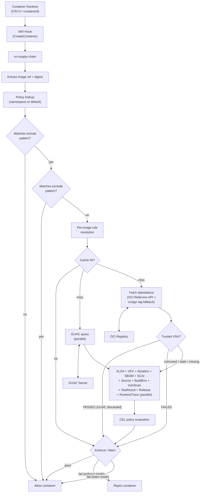

# Supply Chain NRI Plugin

[](https://github.com/saschagrunert/nri-supply-chain/actions/workflows/ci.yml)
[](https://github.com/saschagrunert/nri-supply-chain/actions/workflows/release.yml)
[](https://github.com/saschagrunert/nri-supply-chain/releases/latest)
[](https://codecov.io/gh/saschagrunert/nri-supply-chain)
[](https://pkg.go.dev/github.com/saschagrunert/nri-supply-chain)

An [NRI](https://github.com/containerd/nri) plugin for supply chain attestation
verification at the container runtime level. It intercepts container creation
events on [CRI-O](https://cri-o.io) or [containerd](https://containerd.io) and
verifies SLSA provenance, VEX, VSA, Notation signatures, SBOM, SCAI,
Source Track, Build Environment, Vulnerability Scan, and Test Result
attestations, and CEL policy expressions before a container is allowed to run.
It also integrates with [GUAC](https://guac.sh/) for transitive dependency
analysis, vulnerability correlation, and OpenSSF Scorecard queries.

Runtime-level enforcement cannot be bypassed by misconfigured admission
webhooks, disabled policy controllers, or direct kubelet API calls. The plugin
operates below the Kubernetes API layer, so every container that runs on a node
must pass verification.

For a detailed introduction, see the [CNCF blog post](https://www.cncf.io/blog/2026/07/30/runtime-supply-chain-verification-using-the-node-resource-interface-nri/).

<!-- toc -->

- [Quickstart](#quickstart)
- [Compatibility](#compatibility)
- [Architecture](#architecture)
- [Verification](#verification)
- [Configuration](#configuration)
- [Deployment and Examples](#deployment-and-examples)
- [Operations](#operations)
- [Supply Chain Compliance](#supply-chain-compliance)
- [Verifying Releases](#verifying-releases)

<!-- /toc -->

## Quickstart

1. Download the latest release binary or container image from the
   [releases page](https://github.com/saschagrunert/nri-supply-chain/releases).

2. Create a configuration file (`config.toml`):

   ```toml
   verification = "enforce"
   policy_dir = "/etc/nri-supply-chain/policies"
   ```

3. Create a default policy (`/etc/nri-supply-chain/policies/default.json`):

   <!-- quickstart-policy-basic -->

   ```json
   {
     "trust": {
       "issuers": ["https://token.actions.githubusercontent.com"],
       "sanPatterns": ["https://github.com/saschagrunert/nri-supply-chain/**"],
       "sources": ["https://github.com/saschagrunert/*"]
     },
     "slsa": { "missingPolicy": "deny" },
     "vex": { "missingPolicy": "deny" },
     "sbom": { "missingPolicy": "deny" }
   }
   ```

   <!-- /quickstart-policy-basic -->

4. Verify a single image to test the configuration:

   ```console
   nri-supply-chain --config config.toml \
     verify ghcr.io/saschagrunert/nri-supply-chain:0.4.0
   ```

   The default output is a colored table:

   ```text
   Image: ghcr.io/saschagrunert/nri-supply-chain:0.4.0
   Digest: sha256:abc123...
   Namespace: default
   Policy: /etc/nri-supply-chain/policies/default.json
   Mode: enforce
   Result: ALLOWED

   TYPE           STATUS   DETAIL
   SLSA           pass     SLSA provenance verified
   VEX            pass     VEX verification passed
   NOTATION       pass     no Notation signature found for image ghcr.io/saschagrunert/nri-supply-chain:0.4.0
   SBOM           pass     SBOM verification passed
   SCAI           pass     no SCAI attestation found for image ghcr.io/saschagrunert/nri-supply-chain:0.4.0
   SOURCE         pass     source verification passed
   BUILDENV       pass     build environment verification passed
   VULNSCAN       pass     vulnerability scan verification passed
   TESTRESULT     pass     test result verification passed
   RELEASE        pass     release verification passed
   RUNTIMETRACE   pass     no runtime trace attestation found for image ghcr.io/saschagrunert/nri-supply-chain:0.4.0
   ```

   Use `--output json` for machine-readable output:

   ```json
   {
     "image": "ghcr.io/saschagrunert/nri-supply-chain:0.4.0",
     "digest": "sha256:abc123...",
     "namespace": "default",
     "allowed": true,
     "checkResults": [
       {
         "type": "slsa",
         "passed": true,
         "status": "pass",
         "detail": "SLSA provenance verified"
       },
       {
         "type": "vex",
         "passed": true,
         "status": "pass",
         "detail": "VEX verification passed"
       },
       {
         "type": "notation",
         "passed": true,
         "status": "pass",
         "detail": "no Notation signature found for image ghcr.io/saschagrunert/nri-supply-chain:0.4.0"
       },
       {
         "type": "sbom",
         "passed": true,
         "status": "pass",
         "detail": "SBOM verification passed"
       },
       {
         "type": "scai",
         "passed": true,
         "status": "pass",
         "detail": "no SCAI attestation found for image ghcr.io/saschagrunert/nri-supply-chain:0.4.0"
       },
       {
         "type": "source",
         "passed": true,
         "status": "pass",
         "detail": "source verification passed"
       },
       {
         "type": "buildenv",
         "passed": true,
         "status": "pass",
         "detail": "build environment verification passed"
       },
       {
         "type": "vulnscan",
         "passed": true,
         "status": "pass",
         "detail": "vulnerability scan verification passed"
       },
       {
         "type": "testresult",
         "passed": true,
         "status": "pass",
         "detail": "test result verification passed"
       },
       {
         "type": "release",
         "passed": true,
         "status": "pass",
         "detail": "release verification passed"
       },
       {
         "type": "runtimetrace",
         "passed": true,
         "status": "pass",
         "detail": "no runtime trace attestation found for image ghcr.io/saschagrunert/nri-supply-chain:0.4.0"
       }
     ]
   }
   ```

   To enable VSA-accelerated verification, add a `trust.verifiers` entry.
   A trusted VSA short-circuits all other checks:

   <!-- quickstart-policy-vsa -->

   ```json
   {
     "trust": {
       "issuers": ["https://token.actions.githubusercontent.com"],
       "sanPatterns": ["https://github.com/saschagrunert/nri-supply-chain/**"],
       "sources": ["https://github.com/saschagrunert/*"],
       "verifiers": [
         {
           "id": "https://github.com/saschagrunert/nri-supply-chain/.github/workflows/release.yml"
         }
       ]
     },
     "slsa": { "missingPolicy": "deny" },
     "vex": { "missingPolicy": "deny" },
     "sbom": { "missingPolicy": "deny" }
   }
   ```

   <!-- /quickstart-policy-vsa -->

   With this policy the default table output becomes:

   ```text
   Image: ghcr.io/saschagrunert/nri-supply-chain:0.4.0
   Digest: sha256:abc123...
   Namespace: default
   Policy: /etc/nri-supply-chain/policies/default.json
   Mode: enforce
   Result: ALLOWED
   Reason: VSA verification passed, skipping direct verification

   TYPE   STATUS   DETAIL
   VSA    pass     VSA verification passed
   ```

   In `enforce` mode images that fail verification are rejected. Use
   `verification = "warn"` to observe what would be blocked without
   rejecting. See [docs/verification.md](docs/verification.md) for the
   full verification flow.

5. Deploy the plugin (requires NRI enabled on the container runtime, see
   [Runtime Requirements](docs/deployment.md#runtime-requirements)).
   Edit the placeholder values (`myorg`) in the ConfigMap before deploying:

   ```console
   kubectl apply -f deploy/kubernetes/
   ```

6. Check the logs and metrics to observe verification decisions.

## Compatibility

| Component  | Supported Versions  |
| ---------- | ------------------- |
| Kubernetes | 1.26+               |
| CRI-O      | 1.28+ (NRI enabled) |
| containerd | 1.7+ (NRI enabled)  |
| NRI        | 0.6+                |
| Go (build) | 1.27+               |

NRI must be enabled in the container runtime configuration. See
[Runtime Requirements](docs/deployment.md#runtime-requirements) for details.

## Architecture

<details>
<summary>Verification flow diagram</summary>


```mermaid
flowchart TD
    Runtime["Container Runtime\n(CRI-O / containerd)"]
    NRI["NRI Hook\n(CreateContainer)"]
    Plugin["nri-supply-chain"]
    Extract["Extract image ref + digest"]
    Policy["Policy lookup\n(namespace or default)"]
    Include{"Matches include\npattern?"}
    Exclude{"Matches exclude\npattern?"}
    Rules["Per-image rule\nresolution"]
    Cache{"Cache hit?"}
    GUAC["GUAC query\n(parallel)"]
    Fetch["Fetch attestations\n(OCI Referrers API +\ncosign tag fallback)"]
    VSA{"Trusted VSA?"}
    Parallel["SLSA + VEX + Notation + SBOM + SCAI\n+ Source + BuildEnv + VulnScan\n+ TestResult + Release\n+ RuntimeTrace (parallel)"]
    CEL["CEL policy evaluation"]
    Enforce{"Enforce / Warn"}
    Allow["Allow container"]
    Reject["Reject container"]
    Registry["OCI Registry"]
    GUACServer["GUAC Server"]

    Runtime --> NRI --> Plugin --> Extract --> Policy --> Include
    Include -- no --> Allow
    Include -- yes --> Exclude
    Exclude -- yes --> Allow
    Exclude -- no --> Rules --> Cache
    Cache -- hit --> Enforce
    Cache -- miss --> GUAC & Fetch
    GUAC <--> GUACServer
    Fetch <--> Registry
    Fetch --> VSA
    VSA -- "PASSED (GUAC discarded)" --> Enforce
    VSA -- "FAILED" --> Enforce
    VSA -- "untrusted / stale / missing" --> Parallel
    GUAC --> Parallel
    Parallel --> CEL --> Enforce
    Enforce -- pass --> Allow
    Enforce -- "fail (enforce mode)" --> Reject
    Enforce -- "fail (warn mode)" --> Allow
```

</details>

The plugin runs as a long-lived process that connects to the container runtime
via NRI. It exposes Prometheus metrics and supports live config reload via
SIGHUP.

At startup, the NRI Synchronize callback delivers the list of pods and
containers already running on the node. The plugin collects their image
references, resolving missing digests via registry `HEAD` requests when
needed (for example, on containerd where NRI annotations may omit the
digest). It deduplicates by digest and namespace, then spawns a background
goroutine that pre-verifies each image. This warms the cache so that
verification results are immediately available if those containers are
restarted, avoiding a cold-cache fetch penalty.

## Verification

The plugin verifies SLSA provenance, VEX, VSA, Notation, SBOM, SCAI, Source
Track, Build Environment, Vulnerability Scan, and Test Result attestations
with optional CEL policy expressions and GUAC integration. It extracts
image references and digests from CRI-O or containerd NRI annotations,
resolves missing digests via registry HEAD requests, and applies per-namespace
policies. VSA from a trusted verifier can short-circuit all other checks.

For the full verification flow, annotation handling details, and per-type
checks, see [docs/verification.md](docs/verification.md).

## Configuration

The plugin uses two configuration layers:

- **Operational config** (TOML): controls the plugin behavior (mode, timeouts,
  cache, metrics). See [docs/config.md](docs/config.md) for the full field
  reference and CLI flags.
- **Policy files** (JSON): define per-namespace trust roots and verification
  requirements. See [docs/policy.md](docs/policy.md) for the field reference,
  pattern matching semantics, and deployment patterns.

## Deployment and Examples

See [docs/deployment.md](docs/deployment.md) for all deployment options
(DaemonSet, systemd, DEB/RPM, container image, pre-installed NRI plugin) and
example configurations (gradual rollout, strict production, VSA-accelerated).

See [`deploy/examples/policies/`](deploy/examples/policies/) for ready-to-use
policy files covering keyless, key-based, Notation, SBOM, SCAI, Source Track,
Build Environment, Vulnerability Scan, Test Result, VEX-strict,
VSA-accelerated, CEL, and other scenarios.

## Operations

The plugin exposes Prometheus metrics, `/healthz` and `/readyz` endpoints,
and supports live config reload via SIGHUP or filesystem watching. See
[docs/operations.md](docs/operations.md) for the metrics reference, alerting
rules, troubleshooting guide, internal limits, and security considerations.

## Supply Chain Compliance

This project targets [SLSA Build Level 3](https://slsa.dev/spec/v1.0/levels).
SLSA provenance for both container images and binary artifacts is generated
using
[slsa-github-generator](https://github.com/slsa-framework/slsa-github-generator),
which runs as an isolated reusable workflow with its own signing identity. Each
release also includes an OpenVEX vulnerability assessment, an SPDX SBOM, cosign
keyless signatures, and a Verification Summary Attestation (VSA).

The VSA is still a bootstrapping self-attestation: it is generated by the same
workflow that builds the artifact, so the signer and producer share a workflow
identity. It records that the release pipeline verified its own output, but it
is not independently verifiable by a third party per SLSA's verifier
requirements.

See [docs/threat-model.md](docs/threat-model.md) for a STRIDE-based threat
analysis covering trust boundaries, mitigations, and residual risks.

## Verifying Releases

Release binaries are published with a SHA-256 checksum file that is signed
using [cosign](https://github.com/sigstore/cosign). An SBOM (Software Bill of
Materials) is generated with [syft](https://github.com/anchore/syft) for each
release. SLSA provenance for binary artifacts is generated using the
[slsa-github-generator](https://github.com/slsa-framework/slsa-github-generator)
and uploaded as a release asset. Both versioned releases and the `latest` tag
include full attestation coverage: SLSA provenance, VEX, SBOM,
self-verification, and a
[VSA](https://slsa.dev/spec/v1.0/verification_summary) recording the
verification result from the release pipeline.

To verify a release:

1. Verify the checksum file signature with cosign:

   ```console
   cosign verify-blob --bundle checksums.txt.sigstore.json \
     --certificate-oidc-issuer https://token.actions.githubusercontent.com \
     --certificate-identity-regexp 'https://github.com/saschagrunert/nri-supply-chain/' \
     checksums.txt
   ```

2. Verify the binary against the checksum file:

   ```console
   sha256sum --check checksums.txt
   ```

3. Verify binary SLSA provenance using
   [slsa-verifier](https://github.com/slsa-framework/slsa-verifier):

   ```console
   slsa-verifier verify-artifact nri-supply-chain_<version>_linux_amd64 \
     --provenance-path multiple.intoto.jsonl \
     --source-uri github.com/saschagrunert/nri-supply-chain \
     --source-tag v<version>
   ```

4. Verify container image SLSA provenance using
   [slsa-verifier](https://github.com/slsa-framework/slsa-verifier):

   ```console
   slsa-verifier verify-image ghcr.io/saschagrunert/nri-supply-chain@sha256:<digest> \
     --source-uri github.com/saschagrunert/nri-supply-chain \
     --source-tag v<version>
   ```

   The digest can be obtained via `crane digest ghcr.io/saschagrunert/nri-supply-chain:<version>`.

5. Verify the container image signature:

   ```console
   cosign verify ghcr.io/saschagrunert/nri-supply-chain:latest \
     --certificate-oidc-issuer https://token.actions.githubusercontent.com \
     --certificate-identity-regexp 'https://github.com/saschagrunert/nri-supply-chain/'
   ```

6. Verify the VSA (Verification Summary Attestation) on the container image:

   ```console
   cosign verify-attestation ghcr.io/saschagrunert/nri-supply-chain:latest \
     --type https://slsa.dev/verification_summary/v1 \
     --certificate-oidc-issuer https://token.actions.githubusercontent.com \
     --certificate-identity-regexp 'https://github.com/saschagrunert/nri-supply-chain/'
   ```

7. Inspect the SBOM (generated with syft, integrity covered by the signed
   checksum file from step 1):

   ```console
   cat nri-supply-chain_<version>_linux_amd64.sbom.json | jq .
   ```
